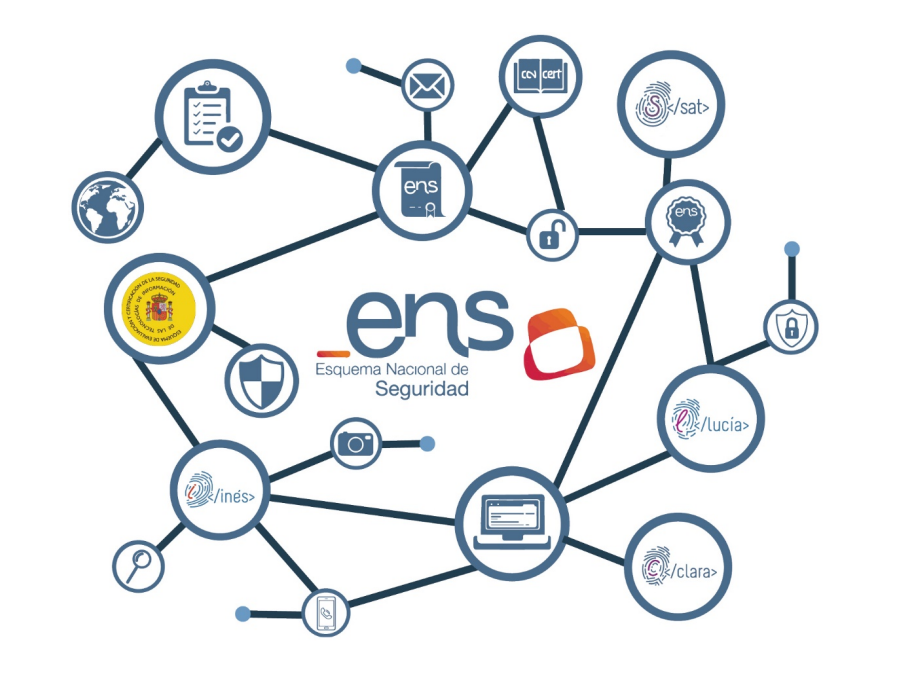

## Acerca de las Auditorías del ENS

La Guía CCN-STIC 802 recoge entre otros apartados, uno dedicado al marco de referencia y al objeto de la auditoría que, tal y como señala el documento, debe ser “el emitir una opinión independiente y objetiva, basada en los principios de integridad, presentación imparcial, debido cuidado profesional, confidencialidad, independencia y enfoque basado en la evidencia, sobre este cumplimiento de tal forma que permita a los responsables correspondientes, tomar las medidas oportunas para subsanar las deficiencias identificadas, si las hubiera”.

La definición del alcance, del equipo auditor, la planificación de la auditoría y sus evidencias, la elaboración y presentación de los hallazgos, así como la presentación del informe y el dictamen final son otros de los puntos del documento. Junto a ellos, seis anexos con los requisitos para el auditor, la incorporación de expertos técnicos, el modelo de acuerdo de confidencialidad, un glosario y bibliografía de referencia.

